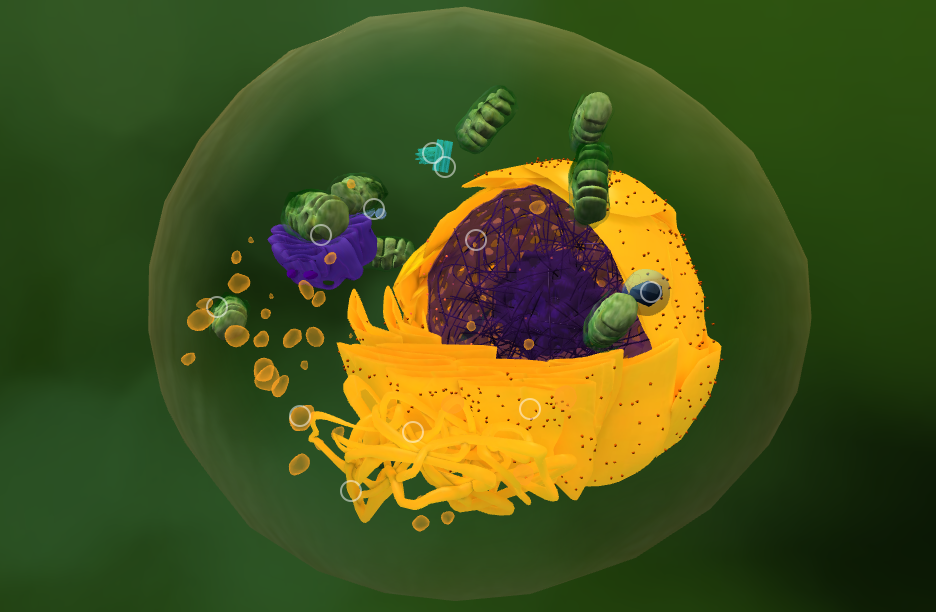
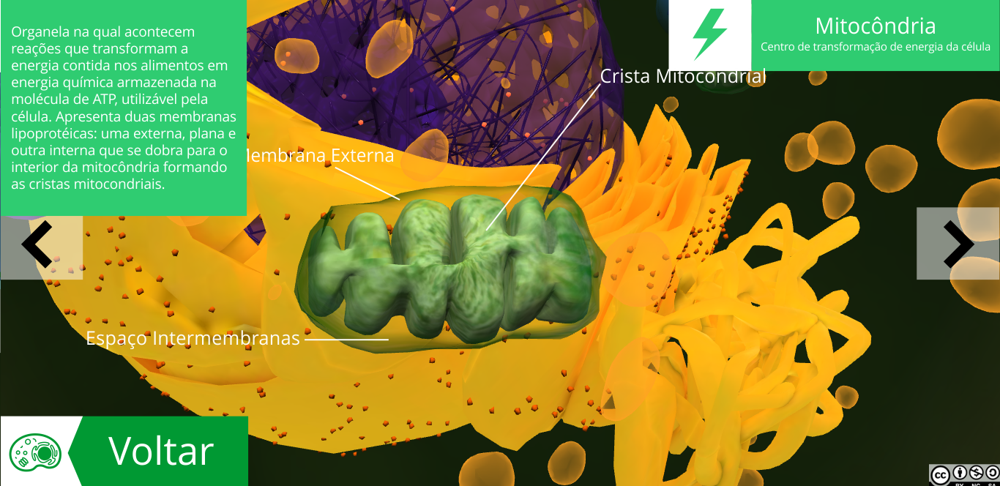
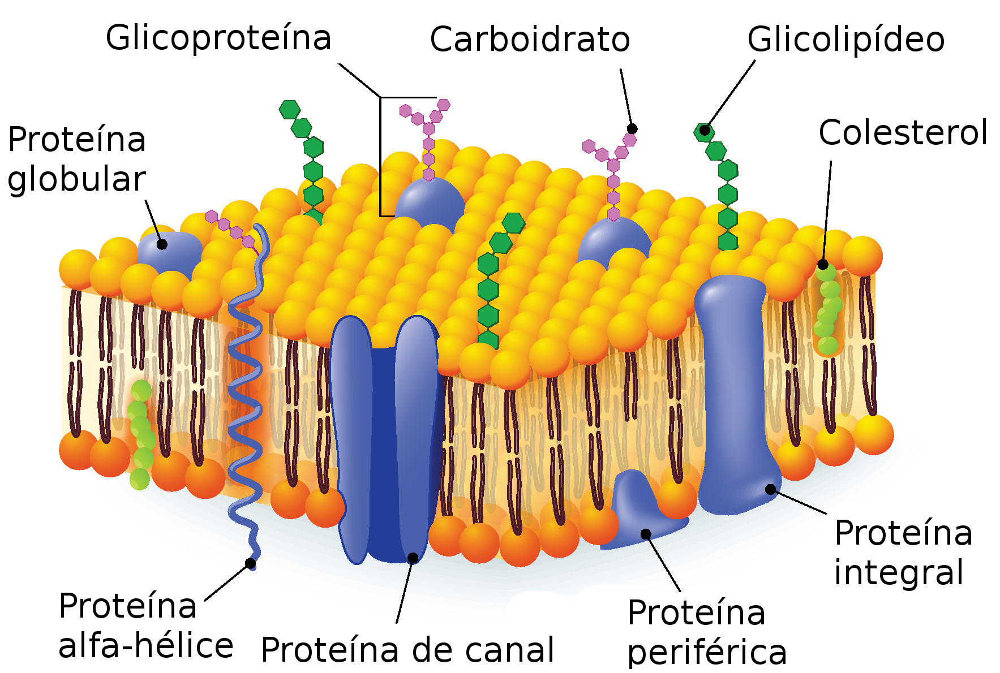

# Biologia - 1º Bimestre

## Células
> 03/03/2021

### Site
Nos foi apresentado um [site](http://3d.cl3ver.com/11VrPc) para visualizar uma célula tridimensionalmente.

O site nos permite ver todas as estruturas da célula eucarionte animal em detalhes, e de maneira didática:

Mitocôndria:

### Teoria celular:

- "A vida existe somente nas células"
- Todo ser vivo é constituido de células.

Ex: algas são constituidas de células eucariontes **vegetais**.

### Mitocôndria

Realiza a respiração celular, dando energia (ATP) à celula e consequentemente ao corpo.

### Estrutura da membrana plasmática:

A membrana possui permeabilidade seletiva. Isso significa que algumas substâncias podem passar através dela.

- Casca de fosfolipídios:
-
-
modelo mosaico fluido

### Recomendação de exercício:

Copie a seguinte tabela e complete-a com ``+`` ou ``-``

|Componentes celulares | Função | Procarionte (bactéria) | (fazer tabela aqui)|
---------|------------
|akdnasd | asdajdsn|

