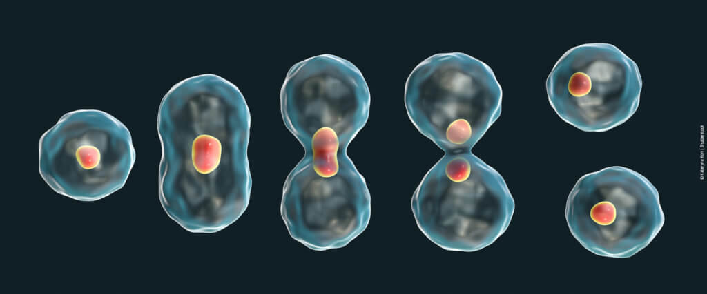

# Biologia - 1º Bimestre

## Células
> 03/03/2021

### Site
Nos foi apresentado um [site](http://3d.cl3ver.com/11VrPc) para visualizar uma célula tridimensionalmente.

O site nos permite ver todas as estruturas da célula eucarionte animal em detalhes, e de maneira didática:

Organela:

### Teoria celular:

- "A vida existe somente nas células"
- Todo ser vivo é constituido de células.

Ex: algas são constituidas de células eucariontes **vegetais**.

### Mitocôndria

Realiza a respiração celular, dando energia (ATP) à celula e consequentemente ao corpo.

### Estrutura da membrana plasmática:

A membrana possui permeabilidade seletiva. Isso significa que algumas substâncias podem passar através dela.

### Recomendação de exercício:

Copie a seguinte tabela e complete-a com ``+`` ou ``-`` no lugar dos x, pensando se a célula em questão possui ou não o componente celular.

| Componentes celulares   | Função                                       | Procarionte (bactéria) | Eucarionte animal | Eucarionte vegetal |
| ----------------------- | -------------------------------------------- | ---------------------- | ----------------- | ------------------ |
| Parede celular          | Proteção: estrutura de suporte               | x                      | x                 | x                  |
| Membrana celular        | Controle da entrada e saída de substâncias   | x                      | x                 | x                  |
| Núcleo                  | Contém o material genético                   | x                      | x                 | x                  |
| Nucleóide               | Material genético                            | x                      | x                 | x                  |
| Mitocôndrias            | Respiração aeróbica                          | x                      | x                 | x                  |
| Cloropastos             | Fotossíntese                                 | x                      | x                 | x                  |
| Vacúolo central         | Reserva de água e outras substâncias         | x                      | x                 | x                  |
| Citoplasma              | Contém as organelas e várias substâncias     | x                      | x                 | x                  |
| Ribossomos              | Síntese de proteínas                         | x                      | x                 | x                  |
| Retículo endoplasmático | Síntese e transporte de proteínas e lipídios | x                      | x                 | x                  |
| Complexo golgiense      | Transformação de proteínas e lipídios        | x                      | x                 | x                  |
| Lisossomos              | Contém as enzimas digestivas                 | x                      | x                 | x                  |

---

## Divisão celular
> 12/03/2021

Uma célula mãe dá origem a 2 ou 4 células filhas.

O DNA da mãe tem que ser o mesmo para os filhos.

O que é o gene: é um trecho do cromossomo que armazena a informação no DNA.

No núcleo, quando é feita a divisão, o DNA se estica para a divisão, para não ficar frágil, as proteínas se condensam.

O conjunto de cromossomos é o DNA.

Cromossomo homólogo: pares iguais de cromossomos. Carregam genes parecidos.
