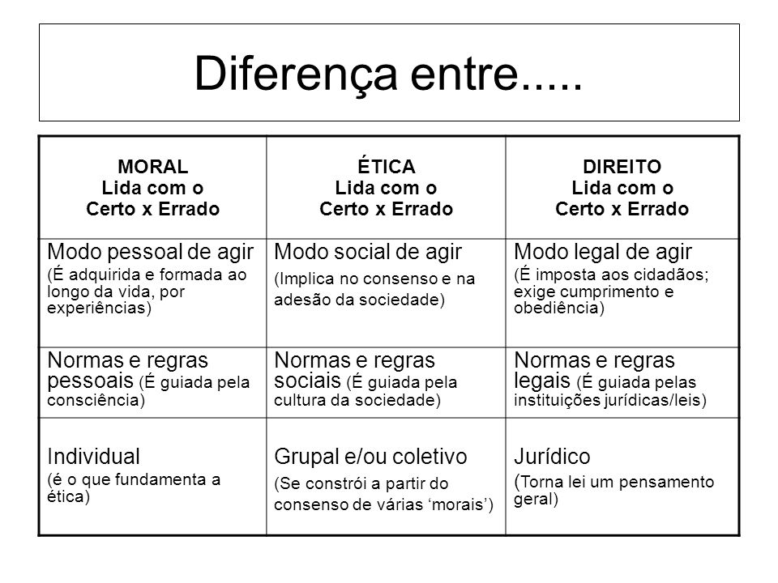

# Filosofia - 1º Bimestres

## Ética, moral e direito
> 03/03/2021

| Moral                       | Ética                       | Direito                     |
| --------------------------- | --------------------------- | --------------------------- |
| Lida com o certo e o errado | Lida com o certo e o errado | Lida com o certo e o errado |
| Modo pessoal de agir        | Modo social de agir         | Modo legal de agir          |
| Normas e regras pessoais    | Normas e regras pessoais    | Normas e regras pessoais    |
| Individual                  | Grupal e coletivo           | Jurídico                    |

### Moral
- Modo pessoal de agir: é adquirida e formada ao longo da vida, por experiências.
- Normas e regras pessoais: é guiada pela consciência.
- Individual: é o que fundamenta a ética.

### Ética
- Modo social de agir: implica no consenso e na adesão da sociedade.
- Normas e regras pessoais: é guiada pela cultura da sociedade.
- Grupal e coletivo: Se constrói a partir do consenso da várias "morais".

### Direito
- Modo legal de agir: é imposta aos cidadâos, exige o cumprimento e obediência.
- Normas e regras legais: é guiada pelas instituições jurídicas/leis.
- Jurídico: torna lei um pensamento geral.

---

### Livro
> Link: https://drive.google.com/file/d/1n1BsJKmN824KzVGrt1vUKNHPJKVUfW51/view

Filosofando: Introdução à Filosofia
1º, 2º e 3º anos - Ensino Médio
Maria Lúcia de Arruda Aranha
Maria Helena Pires Martins

Página 162: Capítulo 12 - Moral, ética e ética aplicada

### Atividade
Ler o capítulo e responder às primeiras 3 atividades da pag. 173.

---

## Iluminismo
> 11/03/2021

Gilles Lipovetsky: filósofo contemporâneo, se baseia em analisar a sociedade para alterar a moral, e consequentemente a ética de forma a evoluir a sociedade.

A era do vazio (1988), livro mais famoso de Lipovetsky. Trata do individualismo.

### Desambiguação Necessária:

Confusão com moral (êthos, epsilon) e ética (éthos, eta).

Segundo Aristóteles êthos é costume, habito, valores culturais, etc.

Pensar em moral como morada, familiar, habitual, costumeiro.

### Algumas definições:

- Ética: filosofia da moral.
- Pré-modernidade: teocentrismo e idade media (deus).
- Deveres: crença religiosa.
- Modernidade: razão e renascentismo (antropocentrismo).
- Ética universalista laica: emancipação da moral em relação à igreja e à crença.
- Deveres: direitos fundamentais do indivíduo.
- Felicidade: valor essencial do ser humano, diretriz central da cultura individualista. Diferentemente da pre-modernidade, a felicidade e o prazer não são mais vista como pecado.

O pensamento do liberalismo econômico restabeleceu as paixões egoístas e vícios particulares como instrumento da prosperidade geral.

- Kant: "top das galaxias dos filósofos" — Professora.
- Pensamento kantiano: glorificação da prática incondicional do dever.
- Pensamento de comte: o único direito é a prática incondicional do dever.

- Ideologia: estudo de uma ideia.

Antes de Marx: estudo de uma ideia sobre vários assuntos.
Depois de Marx: o conceito de ideologia ficou voltado puramente para a política.

## Vídeo sobre ética
> 08/04/2021

Vimos [este vídeo sobre ética](https://www.youtube.com/watch?v=S48AlTBDSVU).
