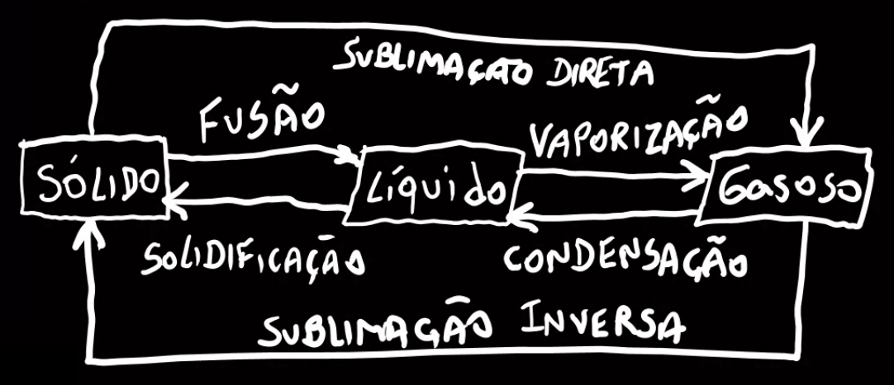
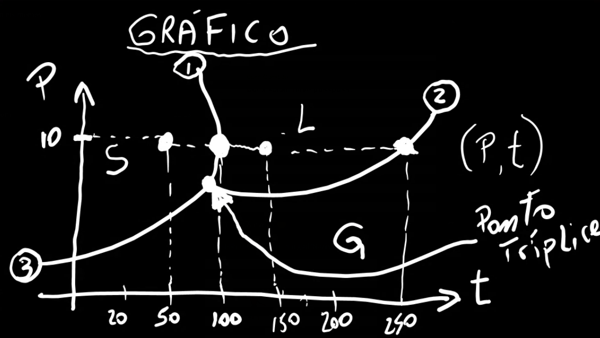

# Física - 1º Bimestre

## Notação científica
> 11/03/2021

É uma forma de escrever um número muito grande ou muito pequeno de forma reduzida.

O professor deu dois exemplos de número:

`230.000.000` -> Muito grande (duzentos e trinta milhões).
`0,00004` -> Muito pequeno.

Regra da notação científica:
- Pega a vírgula, e joga no primeiro número da esquerda`(diferente de 0)
    ```
    230.000.000 = 2,3
    0,00004 = 4
    ```
- Mas para mantermos o valor, teremos que multiplicar por 10 com expoente de quantas casas decimais a vírgula andou.
    ```
    Se a vírgula andou pra esquerda, o expoente é positivo:
    2,3 * 10^8
    (a vírgula andou 8 casas decimais para a esquerda)

    Se a vírgula andou pra direita, o expoente é negativo:
    4 * 10^-5
    (a vírgula andou 8 casas decimais para a direita)
    ```

---

Vimos mais exemplos:

```
0,003 = 3 * 10^-3
0,00002 = 2 * 10^-5
0,000104 = 1,04 * 10^-4

60200000 = 6,02 * 10^9
10500000 = 1,05 * 10^7
20000 = 2 * 10^4
```

---

Abordamos também, que na potenciação com base 10, o expoente é equivalente ao número de zeros.
```
10^0 = 1
10¹ = 10
10² = 100
10³ = 1000
...
```

O mesmo acontece com expoente negativo, mas os zeros são inseridos à esquerda.
```
10^0 = 1
10^-1 = 0,1
10^-2 = 00,1
10^-3 = 000,1
...
```

Por isso, quando multiplicamos na notação científica por 10 elevado à algo, estamos dizendo que adicionamos alguns zeros à direita (expoente positivo, número grande), ou à esquerda (expoente negativo, número pequeno).

---

Depois, começamos a multiplicar notações científicas:
```
x = 2*10^9 * 3*10^4
x = (2*3) * (10^9 * 10^4)
x = 6 * 10^13
```

---

## Atribuição de atividade

> 09/04/2021

Atividade de relatório e autoavaliação

---

## Mudança de Estado Físico da Matéria

> 13/04/2021

Revisamos mudança de fases:



Com exemplos de uma lata de refrigerante, uma janela de carro num tempo frio. Seguindo, nos foi apresentado o ***Diagrama de Fases***, uma representação gráfica com eixo X de Temperatura, e eixo Y de Pressão:



Com suas ***curvas***:

1. Curva de Fusão
2. Curva de Vaporização
3. Curva de Sublimação

Que delimitam qual a fase da matéria, por espaço no gráfico.

E o ***ponto tríplice*** onde coexistem os três estados físicos da matéria. Por não ser possível distinguir uma fase específica, diz-se que, por exemplo, na curva de fusão, têm-se ambos os estados sólido e líquido.

---

