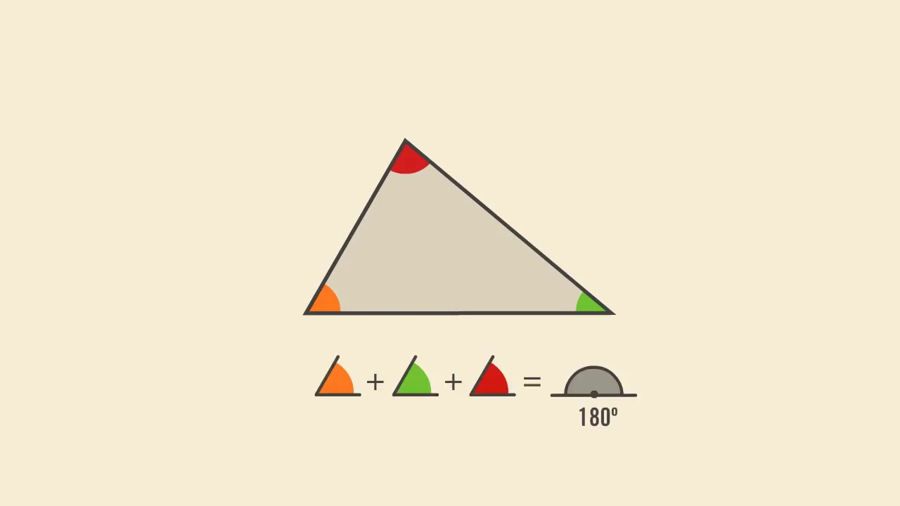
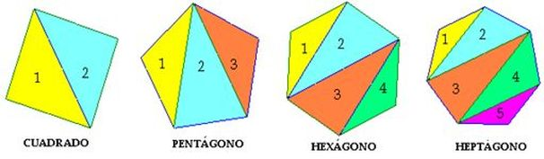
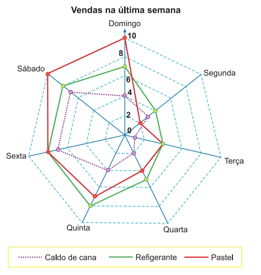
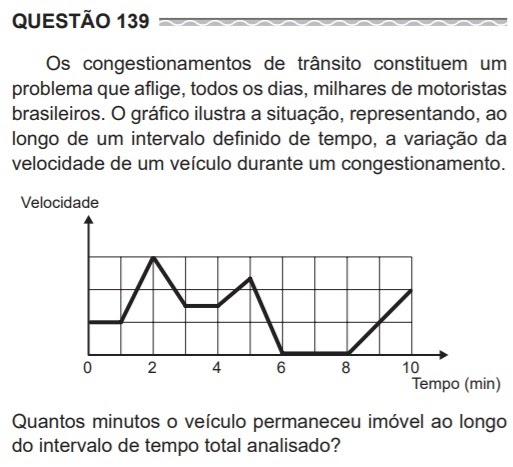

# Matemática - 1º Bimestre

## Formas geométricas e ângulos
> 01/02/2021

> [Documento usado em aula](./Semana%203.1%20-%20Triângulos%20e%20seus%20Ângulos.pdf)

### Formas geométricas


| Nome           | Definição                                           |
| -------------- | --------------------------------------------------- |
| Quadrilátero   | Polígono de quadro lados                            |
| Trapésio       | Pelo menos dois lados paralelos                     |
| Paralelogramos | Quatro lados paralelos (pares de lados paralelos)   |
| Losango        | Medidas iguais e paralelas sem ângulos retos ?      |
| Retângulo      | Todos os quatro lados paralelos e com angulos retos |
| Quadrado       | Retângulo com lados iguais                          |

---

### Ângulos

| Nome                      | Definição                                            |
| ------------------------- | ---------------------------------------------------- |
| Complementar              | Ângulos em que a soma é 90° (ângulo reto)            |
| Sumplementar              | Que somam 180° (ângulo raso)                         |
| Oposto pelo vértice (OPV) | Auto-descritivo, estam opostos entre si pelo vértice |
| Alternos internos         | localizados na região externa das retas paralelas    |


> Exemplo alterno externo

---

## Triângulos e ângulos internos
> 20/03/2021 — Aula 1

> [Documento usado em aula](./Semana%203.2%20-%20Soma%20de%20ângulos.pdf)

Foram revistos os conceitos de OPV e Alternos internos.
(Comentamos sobre o Zorro :V)


### Soma dos Ângulos Internos de um Triângulo


#### Demonstrações de exercícios

- Foi feita uma demonstração de exercício, dados dois ângulos internos (30° e 80°), foi calculado o terceiro.

    ```math
    Sabendo que:
    30° + 80° + x = 180°

    Temos que:
    x = 180° - (30° + 80°)

    Logo:
    x = 180° - 110°

    Finalmente:
    x = 70°
    ```

- Num triângulo dentro de um retângulo, foram calculadas os valores dedos seus ângulos internos.
- Com dois triângulos (um em cima do outro) unidos pelo vértice, tínhamos que o ângulo interno do vértice do triângulo inferior valia 70°, logo, se aferiu o mesmo valor ao ângulo interno do vértice do triângulo superior.

---

### Ângulos internos de um polígono regular
Foi comentado que estudamos muito triângulos, pois, quando temos polígonos (regulares) mais complexos, podemos transformá-los em triângulos para facilitar a sua análise.



---

## Porcentagem
> 02/03/2021 — Aula 2

> [Documento usado em aula](./Semana%203.3%20-%20Porcentagem%20Fácil.pdf)

Como discutimos, "porcentagem" ou "percentagem" estão corretos.

Porcentagem é considerar que algo é 100 (quando inteiro), para analisá-lo (em partes).

Muito ou pouco é relativo à o que é analisado.

### Diferentes formas de calcular
Exemplo: 50% de R$ 16

#### Multiplicação
1. Transformar a porcentagem para um decimal.
   - No caso, 50% em 0,50 (30% seria 0,30 e 100% seria 1,00)
2. Pegar o valor analisado e multiplicar.
   - No caso, 16 * 0,50 = 8

#### Regra de três
```math
100 - está para -> 16
      assim como
50 -- está para -> x

100x = 16 * 50
100x = 800
x = 800 / 100
x = 8
```

#### Fácil
> Proporção

Se 50 é a metade de 100, o resultado que procuramos é a metade de 16, logo 8.

> Quando pensamos em proporção, devemos pensar em multiplicação e divisão, nunca adição.
>
> Suponhamos que uma receita tem 1 lata de leite e 3 colheres de chocolate, se aumentarmos 1 lata, não devemos aumentar 1 colher (adicionando). Como multiplicamos a quantidade de latas por 2, devemos fazer o mesmo com as colheres, multiplicando 3 por 2, temos 6 colheres de chocolate.

---

## Exercícios de porcentagem
> 04/03/2021

> [Documento usado em aula](./Semana%203.4%20-%20Problemas%20Porcentagem.pdf)

Revisamos o conceito de porcentagem e resolvemos 3 questões do Enem.

Dica: no Enem, sempre leia o final das questões antes do resto do enunciado.

### Exercícios:

1 - O quadro representa os gastos mensais de uma família com internet, mensalidade escolar e mesada do filho.

| Internet | Mensalidade | Mesada |
| -------- | ----------- | ------ |
| 120      | 700         | 400    |

No início do ano, a **internet** e a **mensalidade escolar** tiveram acréscimos, respectivamente, de **20%** e de **10%**.
Necessitando manter o valor total da despesa mensal, a família reduzirá a mesada do filho.
**Qual será a porcentagem de redução da mesada?**

a) 15,0

b) 23,5 <--

c) 30,0

d) 70,0

e) 76,5

```
Valor subtraído da internet:

20% de 120 =
120 * 1.2 =
144

Portanto, o aumento foi de R$24,00.

Valor subtraído da mensalidade da escola:

10% de 700 =
700 * 1.1 =
770

Portanto, o aumento foi de R$70,00.

Somando os valores 24 + 70, temos que o valor que precisa ser subtraído da mesada é de R$94,00.

Efetuando uma regra de três simples, temos que:

400 ------- 100
 94 -------   x

400x = 100 * 94
400x = 9400
x = 9400/400
__________
|x = 23,5|
‾‾‾‾‾‾‾‾‾‾
```

2 - Segundo o Instituto Brasileiro de Geografia e Estatística (IBGE), o rendimento médio mensal dos trabalhadores brasileiros, no ano de 2000, era de **R$1250,00**. Já o censo de 2010 mostrou que esse valor teve um aumento de **7,2%** em relação a 2000. Há uma projeção de que, em 2020, o rendimento médio mensal dos trabalhadores brasileiros será de **10%** maior que em 2010.
**Supondo que as projeções estejam certas, o rendimento mensal dos brasileiros em 2020 será de:**

a) R$1 340,00

b) R$1 349,00

c) R$1 375,00

d) R$1 465,00

e) R$1 474,00 <--

```
Salário de 2010:

Aumento de 7,2% em 1250 =
1250 * 1,072 =
1340

Salário em 2020:

Aumento de 10% em 1340 =
1340 * 1,1 =
______
|1474|
‾‾‾‾‾‾
```

3 - Um laboratório realiza exames em que é possível observar a taxa de glicose de uma pessoa. Os resultados são analisados de acordo com o quadro a seguir:

| glicemia        | descrição                                                       |
| --------------- | --------------------------------------------------------------- |
| Hipoglicemia    | taxa de glicose menor ou igual a 70mg/dL.                       |
| Normal          | taxa de glicose maior que 70 mg/dL e menor ou igual a 100mg/dL. |
| Pré-diabetes    | taxa de glicose maior que 100mg/dL e menor ou igual a 125mg/dL. |
| Diametes Melito | taxa de glicose maior que 125mg/dL e menor ou igual a 250mg/dL. |
| Hiperglicemia   | taxa de glicose maior que 250mg/dL.                             |

Um paciente fez um exame de glicose nesse laboratório e comprovou que estava com hiperglicemia. Sua taxa de glicose era de 300mg/dL. Seu médico prescreveu um tratamento em duas etapas. Na primeira etapa ele conseguiu reduzir sua taxa em **30%** e na segunda etapa em **10%**.

**Ao calcular sua taxa de glicose após as duas reduções, o paciente verificou que estava na categoria de:**

a) hipoglicemia.

b) normal.

c) pré-diabetes.

d) diabetes melito. <--

e) hiperglicemia.

```
Redução de 30% em 300:

Pense que retirar 30% de um número é o mesmo que encontrar 70% dele mesmo, pois 100% - 30% = 70%.

70% de 300 =
300 * 0,7 =
210

Redução de 10% em 210:

O mesmo raciocínio se aplica ao 10%.
100% - 10% = 90%.

90% de 210 =
_____
|189|
‾‾‾‾‾

189 fica entre 125 e 250, portanto, se encaixa como diabetes melito.

```

## Exercícios de Porcentagem e Revisão de Operações
> 08/03/2021

### Exercícios de Porcentagem

Vimos nas duas últimas questões do formulário (as de resposta aberta) e corrigimos detalhadamente com discussões sobre as diferentes abordagens.

4. Sara trabalha em uma loja de sapatos e ganha uma comissão de 25% sobre o valor das vendas que faz. Seu salário fixo é de 2000 reais. Qual valor ela deve vender em sapatos para que seu rendimento total seja 250% do seu salário fixo?

```
250% do salário = 250% de 2000
200% seria o dobro, logo 4000
50% seria a metade, logo 1000
Portanto 250% seria 5000

Se ela ganha 2000 e quer 5000, precisa ganhar mais 3000
Como 3000 com 25% de comissão é um quarto do total que ela precisa vender,
precisa vender (3000 * 4), logo 12000
```

5. Júlio ganhou 50 reais de sua tia. Ela disse que ele tinha que dividir com a irmã dele e também guardar um pouco para uma eventual emergência. Júlio decidiu dar metade do valor para sua irmã e depois guardou 10 reais do que ficou com ele. A irmã disse que isso não seria justo e que ele deveria fazer o contrário, primeiro guardar 10 reais e depois dividir o que sobrou com ela pela metade. O que você acha dessa história? A ordem das operações faz mesmo diferença? Na sua opinião, o que Júlio deveria fazer? Porquê?

Nessa, existem diversas abordagens do que seria "justo", vimos e discutimos acerca.

---

### Revisão de operações

Demos uma pairada sobre conceitos "básicos" de ordem de operações, operações inversas, uso de parênteses para a mudança de ordem, e outros conceitos do gênero.

---
## Operações
> 09/03/2021

Revimos mais sobre operações, com propriedades distributivas, forças das operações, mudanças dos resultados em função da ordem, etc.

---

## Terminologia e Gráficos
> 05/04/2021

> [Documento usado em aula](./Semana%205.1%20-%20Operações%20e%20Gráficos.pdf)

---

## Exercícios de gráficos
> 06/04/2021

> [Documento usado em aula](./Semana%205.2%20-%20Gráficos%20de%20Linha%20.pdf)

Revisamos o conceito de gráficos, servindo para mostrar comparações, tendências, etc.

---

Resolvemos o seguinte exercício juntos:

> ENEM 2019:
> Um comerciante, que vende somente pastel, refrigerante em lata e caldo de cana em copos, fez um levantamento das vendas realizadas durante a semana. O resultado desse levantamento está apresentado no gráfico.
>
> 
>
> Ele estima que venderá, em cada dia da próxima semana, uma quantidade de refrigerante em lata igual à soma das quantidades de refrigerante em lata e caldo de cana em copos vendidas no respectivo dia da última semana.
>
> Quanto aos pastéis, estima vender, a cada dia da próxima semana, uma quantidade igual à quantidade de refrigerante em lata que prevê vender em tal dia. Já para o número de caldo de cana em copos, estima que as vendas diárias serão iguais às da última semana.
>
> Segundo essas estimativas, a quantidade a mais de pastéis que esse comerciante deve vender na próxima semana é:
>
> a. 20.    
> b. 27.    
> c. 44.    
> d. 55.    
> e. 71.    

---

Também resolvemos juntos a seguinte questão:

> 
>
> a. 4.     
> b. 3.     
> c. 2.     
> d. 1.     
> e. 0.     
