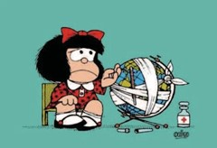

# Português - 1º Bimestre

## Luís Vaz de Camões
> 01/03/2021

### Breves pontos sobre a biografia:

- Nasceu em Lisboa.
  - pequena nobreza.
- A arte era muito valorizada pelos reis.
  - Se ele escrevesse um livro, seria custeado pelo governo.
- Luís se apaixonou por uma mulher.
  - Teria escrito Lusíadas numa embarcação (com a mulher).
  - Teria escolhido o livro em vez dela (deixado-a morrer).
- Um dos principais representantes da literatura classicista.

### Poema: Mudam-se os tempos, mudam-se as vontades:

A grande paixão dos homens gregos era por outros homens. Muitos se relacionavam com mulheres apenas por reprodução.
Esse é um exemplo de "mudam-se os tempos, mudam-se as vontades".

> Muda-se o ser, muda-se a confiança;
> Todo o mundo é composto de mudança,
> Tomando sempre novas qualidades.
>
> Continuamente vemos novidades,
> Diferentes em tudo da esperança;
> Do mal ficam as mágoas na lembrança,
> E do bem, se algum houve, as saudades.

O poema apresenta antítese e pessimismo ao pressupor que não existem boas memórias (ideias opostas).

> O tempo cobre o chão de verde manto,
> Que já coberto foi de neve fria,
> E em mim converte em choro o doce canto.
>
>E, afora este mudar-se cada dia,
> Outra mudança faz de mor espanto:
> Que não se muda já como soía.

Ideia de desconserto do mundo.

> — Luís de Camões Camões, L. V. de. 200 Sonetos. Porto Alegre: L&PM. 1998.

Texto construído com pronomes indefinidos ("alguns"), trás uma ideia de incerteza e distanciamento.
## Coesão e Coerência
> 02/03/2021

Um bom texto é aquele em que o leitor é conduzido à compreensão imediata, exceto em casos em que há um público alvo muito específico.

### Coesão textual:

São as conexões gramaticais responsáveis pela articulação de palavras, produz o sentido.

#### Por remissão:

Os pronomes estabelecem relações remissivas sem que se faça repetição de termos.

> O psiquiatra americano Allen Frances acha que **usamos remédios demais**, e para tratar gente que passaria bem sem **eles**.

#### Por repetição/reiteração:

Dá sentido de ênfase.

> Cada um é responsável por todos. Cada um é o único responsável. Cada um é o único responsável por todos.

> — Antoine de Saint-Exupéry

#### Por substituição:

Um elemento é substituído por um sinônimo sem prejudicar o sentido da ideia.

> ÉPOCA – As pessoas se sentem melhor ao tomar essas **pílulas**, mesmo sem precisar delas?
>
> Frances – As pesquisas mostram que a resposta dessas pessoas aos **remédios** não é muito maior do que a resposta a um placebo.

> Entrevista completa: https://epoca.globo.com/vida/noticia/2016/09/receitamos-remedios-psiquiatricos-gente-saudavel-diz-medico-allen-frances.html

#### Por contiguidade:

Estabelece uma unidade de discurso apresentando elementos de um mesmo campo semântico.

> Frances – [...] Quando as taxas de desemprego aumentam, as taxas de depressão aumentam também. Melhor do que receitar **antidepressivos** para as pessoas seria garantir-hes melhor apoio social, para ajudá-las durante o tempo em que estiverem desempregadas

### Coerência textual

Conexões lógico-semânticas faz o texto ter um significado por completo. Vêm do desenvolvimento de ideias, seleção do vocabulário, suporte, etc.

### Reflexão

#### Tema da redação da Fuvest 2021:
O mundo contemporâneo está fora de ordem?

##### Texto 1

> O neoliberalismo define certa norma de vida nas sociedades ocidentais, e, para além dela, em todas as sociedades que as seguem no caminho da “modernidade”. Essa norma impõe a cada um de nós que vivamos num universo de competição generalizada, intima os assalariados e as populações a entrar em luta econômica uns contra os outros, ordena as relações sociais segundo o modelo do mercado, obriga a justificar desigualdades cada vez mais profundas, muda até o indivíduo, que é instado a conceber a si mesmo e a comportar-se como uma empresa.

> Pierre Dardot e Christian Laval. A nova razão do mundo: ensaio sobre a sociedade neoliberal, 2016.

Discutimos em aula que este é um texto crítico, no sentido em que contra-argumenta uma ideologia política.
(Iniciou-se uma pequena discussão no chat :V)

##### Texto 2

> As mais soberbas pontes e edifícios,
> o que nas oficinas se elabora,
> o que pensado foi e logo atinge
>
> distância superior ao pensamento,
> os recursos da terra dominados,
> e as paixões e os impulsos e os tormentos
>
> e tudo que define o ser terrestre
> ou se prolonga até nos animais
> e chega às plantas para se embeber
>
> no sono rancoroso dos minérios,
> dá volta ao mundo e torna a se engolfar
> na estranha ordem geométrica de tudo,
>
> (…)

> Carlos Drummond de Andrade, “A máquina do mundo”, de Claro Enigma, 1951.

O contexto é a desilusão do mundo num pós-guerra.

##### Texto 3

> Aqui tudo parece que era ainda construção e já é ruína
> Tudo é menino, menina no olho da rua
> O asfalto, a ponte, o viaduto ganindo pra lua
> Nada continua…
> (…)
> Alguma coisa está fora da ordem
> Fora da nova ordem mundial

> — Caetano Veloso. Trecho da música Fora da Ordem, 1991.

Tivemos acesso à [musica no YouTube](https://www.youtube.com/watch?v=HUb-z8C3CBs) na íntegra.

##### Texto 4
> 

> Quino, Mafalda. Assim vai o mundo!

Foi discutida a linguagem não verbal e o significado desta tira.

##### Texto 5
> Os adultos ficam dizendo: “devemos dar esperança aos jovens”. Mas eu não quero a sua esperança. Eu não quero que vocês estejam esperançosos. Eu quero que vocês estejam em pânico. Quero que vocês sintam o medo que eu sinto todos os dias. E eu quero que vocês ajam. Quero que ajam como agiriam em uma crise. Quero que vocês ajam como se a casa estivesse pegando fogo, porque está.

> Greta Thunberg, Trecho de discurso em Davos, 2019.

Foi mostrado [outro discurso](https://www.youtube.com/watch?v=mbnRv81s_9Q) da Gretta no YouTube.

#### Atividade
Considerando as ideias apresentadas nos textos e também outras informações que julgar pertinentes, redija uma dissertação em prosa, na qual você exponha o seu ponto de vista sobre o tema: **O mundo contemporâneo está fora da ordem?**

##### Instruções:
> Da Fuvest:
- A dissertação deve ser redigida de acordo com a norma culta padrão da língua portuguesa.
- Escreva, no mínimo, 20 linhas, com letra legível e não ultrapasse o espaço de 30 linhas da folha de redação.
- Dê um título a sua redação.

> Da professora:
- Preferência por arquivo feito no WORD (.docx).
- No email flavalery@yahoo.com ou Google Drive.
- Lembrar de dar um título.
- Lembrar de fazer uma conclusão.
- Até sexta-feira (05/03/2021 às 23h59m).

## Debate de obras
> 04/03/2021

Fomos introduzidos ao livro "Ensaio Sobre a Cegueira", de José Saramago, e iniciamos um debate acerca da intertextualidade entre as três seguintes obras:

- [Uma sabatina com o autor José Saramago](https://www.youtube.com/watch?v=BOLhNxBo6Xo).

- [Trailer da adaptação cinematográfica do livro "Ensaio Sobre a Cegueira"](https://www.youtube.com/watch?v=o4Fyw01Qokw).

- [Clipe da música "É tudo pra ontem", do Emicida](https://www.youtube.com/watch?v=qbQC60p5eZk).

Discutimos as relações entre as obras e as críticas acerca delas.

Discutimos os seguintes tópicos relacionados com as obras acima:

- "Partir, voltar e repartir". Essa sequência se repete diversas vezes ao longo da música.
- A sequência apresenta certa ambiguiade quando percebemos que "partir" e "repartir" possuem mais de um sentido. Essa característica da música se perde quando traduzida para outra línguas.
- No clipe da música, o conto narrado por Gilberto Gil sobre a humanidade nos mostra que mesmo tendo falhas, ainda temos características positivas.
- "E se fossemos todos cegos?" Esse foi o questionamento de Saramago que originou o livro "Ensaio Sobre a Cegueira". Ele chegou à conclusão de que, de certa forma, já somos todos cegos.
- Ao assistir ao trailer do filme e extrair mais informações sobre a obra, concluímos que a real visão é adquirida.
- O fato da cegueira retratada ser branca mostra um aspecto importante da obra. Isso porque, quando questionado sobre a cor da cegueira, fez questão de enfatizar que ela era branca, indo contra o pensamento de outros que alegavam que a cegueira é negra.

## Vida Maria: Debate
> 05/03/2021 (Aula 1)

Foi-nos apresentado o curta "Vida Maria' e debatemos acerca da obra.

> Link do filme : https://www.youtube.com/watch?v=yFpoG_htum4

## Sementes: Debate
> 05/03/2021 (Aula 2)

Vimos o clipe da música "Sementes" do Emicida.

> Link do filme: https://www.youtube.com/watch?v=C7l0AB--I3c

## Produção de Texto: Debate
> 08/03/2021

Debate é considerado produção de texto, seja escrito ou não.

### Sobre o gênero:
- Gênero oral;
- Linguagem argumentativa;
- Defender uma ideia ou ponto de vista;
- Temas polêmicos;
- Os argumentos servem para confirmar ou negar um posicionamento;

### Debates públicos regrados
- Geralmente usado em salas de aula;
- Os alunos podem desenvolver os seus conhecimentos e ampliar seu ponto de vista acerca de determinado assunto;
- Cada participante deve expressar a sua perspectiva sobre um tema, sempre apresentando argumentos coerentes;
- Cada debatedor deve trazer conhecimentos ao debate, contribuindo à compreensão do tema e uma visão ampla;
- Não existe um "vencedor";
- Existe um moderador;

### O papel do moderador
- Regula a interação;
- Organiza os turnos de fala;
- Apresentar os participantes;
- Arbitrar e administrar os conflitos;
- Conciliar as posições, sem tomar partido de ninguém, transparecer imparcialidade;
- Retomar o foco da discussão;
- Encerrar o debate;

### Estratégias argumentativas

#### Argumentação
Consiste na exposição de argumentos com o objetivo de convencer e persuadir.

#### Por raciocínio lógico
Consiste na criação de nexos causais que sustentam o raciocínio defendido. Com encadeamento de ideis conexas e loógicas.

> 📝 Nexos causais: relações de causa e efeito.

#### Por comprovação
Consiste na exposição de informações objetivas, com dados numéricos, percentuais e estatísticas.

#### Por citação
Consiste na referência ao ponto de vista em pessoas consideradas autoridades em determinados assuntos.

#### Contra-argumentação
Consiste em prever e antecipar os argumentos contrários às próprias ideias e posições defendidas. Refutações.

#### Dimensões da oralidade no debate
A presença de marcas de oralidade em um debate depende do nível de informalidade que ele apresenta.

#### Perguntas retóricas
Perguntas respondidas pelo próprio autor, a fim de desestabilizar o adversário e causar reflexão dos espectadores.

---

### Considerar sempre:
- Deve se utilizar a variedade culta da língua.
- Evitar gírias e palavra de baixo calão e marcas de oralidade ("né", "daí", etc.)
- Planejar a participação, o tom de voz adequado, as palavras adequadas, com fim de contribuir para atenção e compreensão da plateia.
- O debatedor e o mediador deve estar atento à reação dos espectadores para ajustar a dinâmica do debate.

---

## Um Boi vê os Homens
> 11/03/2021

Foi-nos apresentado um certo contexto e depois o texto "Um Boi vê os Homens" de Carlos Drummond de Andrade.
> PDF: [Um boi vê os homens [Claro enigma]](./UM-BOI-VE-OS-HOMENS.pdf)

Tão delicados (mais que um arbusto) e correm    
e correm de um para outro lado, sempre esquecidos    
de alguma coisa. Certamente, falta-lhes    
não sei que atributo essencial, posto se apresentem nobres    
e graves, por vezes. Ah, espantosamente graves,    
> Discutimos a relação com o mundo modernos, onde há
> pressa sem objetivo, principalmente em metrópoles.
> Além de uma certa arrogância.

até sinistros. Coitados, dir-se-ia não escutam    
nem o canto do ar nem os segredos do feno,    
como também parecem não enxergar o que é visível    
e comum a cada um de nós, no espaço. E ficam tristes    
> Vimos que "o que é comum a cada um de nós" seria
> a mortalidade.

e no rasto da tristeza chegam à crueldade.    
> A ideia de crueldade: os seres que seriam
> são mais racionais, são os mais cruéis.
> Na natureza, se mata por instinto ou por
> sobrevivência. O ser humano, mata por prazer.

Toda a expressão deles mora nos olhos — e perde-se    
a um simples baixar de cílios, a uma sombra.    
Nada nos pelos, nos extremos de inconcebível fragilidade,    
e como neles há pouca montanha,    
e que secura e que reentrâncias e que
impossibilidade de se organizarem em formas calmas,    
permanentes e necessárias. Têm, talvez,    
certa graça melancólica (um minuto) e com isto se fazem    
perdoar a agitação incômoda e o translúcido    
vazio interior que os torna tão pobres e carecidos    
de emitir sons absurdos e agônicos: desejo, amor, ciúme    
(que sabemos nós?), sons que se despedaçam e tombam no campo    
como pedras aflitas e queimam a erva e a água,    
e difícil, depois disto, é ruminarmos nossa verdade.    

---

A professora está lendo dois livros:

- [A Mulher de Pés Descalços](https://www.amazon.com.br/Mulher-P%C3%A9s-Descal%C3%A7os-Scholastique-Mukasonga/dp/856902018X)
- [O racismo e o negro no Brasil: Questões para a psicanálise](https://www.amazon.com.br/Racismo-Negro-Brasil-Quest%C3%B5es-Psican%C3%A1lise/dp/8527311038)

---

## Exibição de livro "Arnaldo Antunes" e "O Real resiste"
> 05/04/2021

> [Link do clipe](https://www.youtube.com/watch?v=wx_Pd-rpEhc)

## Instruções para Avaliação
> 08/04/2021

A professora nos instruiu a fazer a Avaliação Diagnóstica de Entrada na sexta-feira (já que haverá reunião de professores) e após preencher o gabarito, enviá-lo por e-mail para ela.

Ela nos passou o [PDF da prova](./Avaliação%202º%20Médio%20LP.pdf).

## Biblioteca Sonora: Antigamente
> 08/04/2021

Ouvimos os texto de Drummond "Antigamente".

[Link do vídeo](https://www.youtube.com/watch?v=FHfYonFzOlU)

Esta obra nos mostra que as palavras é dependente do contexto no qual ela está sendo apresentada.
