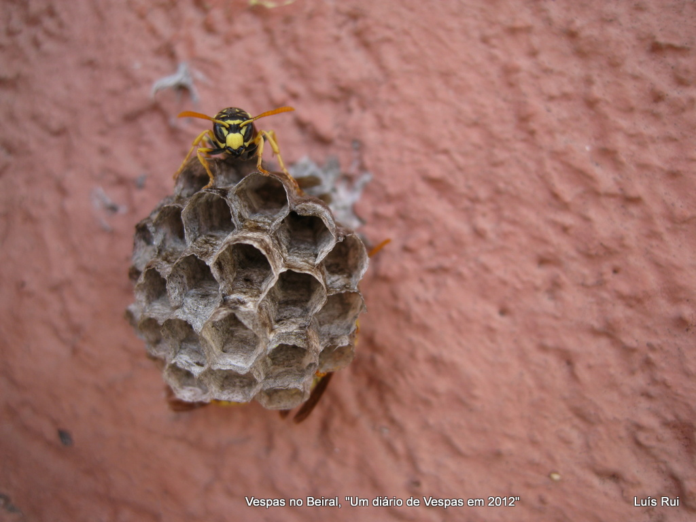
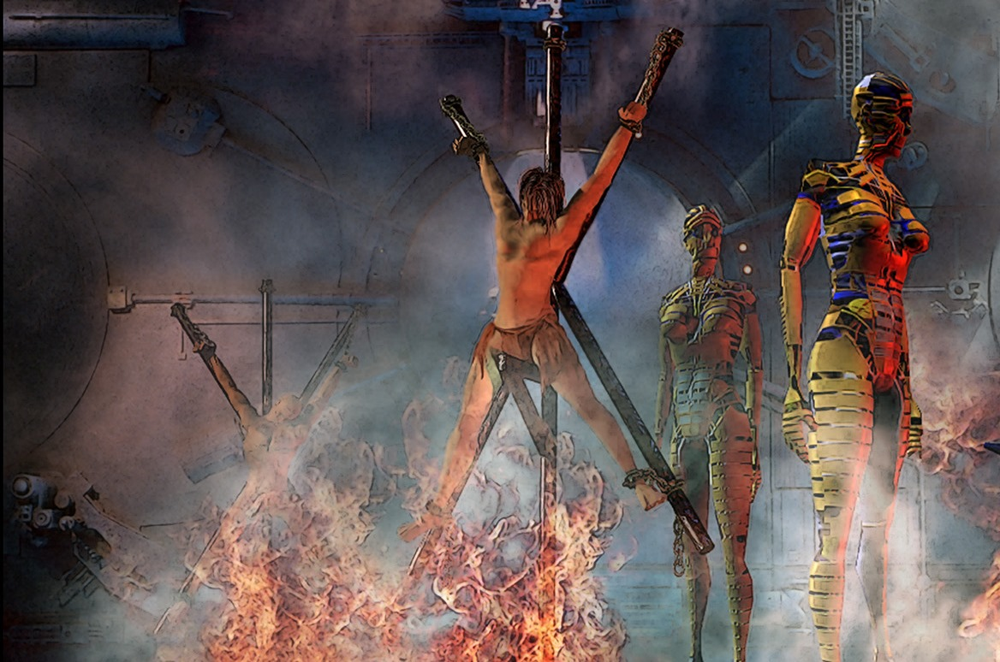

# Sociologia - 1º Bimestre

## Atividade: Olhar sociológico / Os processos de socialização
> 02/03/2021

> [Documento usado em aula](./classroom.pdf)

### Questões:

1 - Explique o que é desnaturalização e qual a sua importância para a Sociologia.

2 - Explique o que são a socialização primária e secundária e dê exemplos.

> A atividade deve ser entregue por meio de um arquivo no Google Classroom.

## Raciocínio humano e Trabalho na cultura
> 03/03/2021

### Trabalho e cultura

Foi revisto o conceito do trabalho como componente do modo de vida humano.

Depois, vimos que podemos idealizar a cultura de um povo, a partir de elementos sociais, mas principalmente a linguagem.

### Racioncínio humano

Foi discutido a diferença entre os homens e os animais e foi comentado o (clichê) conceito de animal racional.

Vimos que modificar a natureza não é necessariamente humano, pois, por exemplo, o castor, modifica até mesmo fluxos de rios. Contudo, essa ação não é necessariamente racionalizada anteriormente.

Uma formiga trabalha, uma abelha trabalha, contudo, o modo de trabalho é de forma instintiva e não raciocinada e planejada. Grupos de formigas de países diferentes, mas da mesma espécie, têm os mesmo comportamentos.

Se tiverem dois humanos, com os mesmos materiais, em salas diferentes, atendendo o pedido de fazer uma cadeira, as duas nunca ficarão iguais, pois essa atividade é planejada e não feita de forma instintiva.

### Trabalho alienado

Karl Marx aborda esse conceito da seguinte forma: a beleza de uma teia de aranha, o cálculo matemático impecável de um ser tão ínfimo. Um humano não faria nada tão perfeito, mas tem a possibilidade de fazer algo diferente, raciocinando.

Vimos um casulo de vespa, que caça um inseto, o pica, o paralisa, coloca o inseto dentro de um casulo, bota os ovos dentro e fecha. Quando pesquisadores tiraram os ovos de dentro do casulo, a vespa seguiu cega/institivamente o próximo passo e colocou o inseto paralisado sem nada dentro do casulo.
Isso mostra que ela olha pra cada passo individualmente e não o todo.

Com isso, comentamos sobre o trabalho alienado, onde se faz um trabalho repetitivo e isolado, sem saber do todo.

---

### Ser humano

Tudo que o ser humano é, foi ensinado a ser.

Se o ser humano não quiser mais fazer uma casa de alvenaria, e quiser voluntariamente fazer casas de materiais recicláveis, ele pode deliberadamente escolher isso. Há liberdade no comportamento humano.

O mesmo trabalha que nos liberta, nos condena a ele.

### Trabalho como condenação

Anteriormente, vimos o mito de Prometeu, mas dessa vez, foi comentado o cristianismo.

Quando Adão e Eva pecaram, foram condenados ao trabalho por Deus.

Se desenrolar uma discussão sobre a dupla condenação da mulher com (além do trabalho), o trabalho de parto e o doméstico (cuidar da prole).

Revimos que o conceito de trabalho vêm do instrumento de tortura: "Tripálio"

### Sobrenomes

> Matéria complementar: A origem dos 15 sobrenomes brasileiros mais populares.
>
> https://super.abril.com.br/mundo-estranho/a-origem-dos-15-sobrenomes-brasileiros-mais-populares/

Sobrenomes de servos e pobres, carregam o sobrenome de ocupação.
> Oliveira, Ferreira, etc.

Sobrenomes de pessoas "de linhagem", carregavam sobrenomes de terras que dominavam.
> Bragança, Orléans, etc.

## Tipos de Trabalho
> 04/03/2021

Os gregos dividiam o trabalho em dois tipos, e definiram que o trabalho mais digno é o trabalho das ideias. Na época, seriam as filosofias, a política e as artes.

Segundo eles, um homem verdadeiramente livre, vive no ócio. Só tinha direito ao ócio quem tinha todas as questões de sobrevivência resolvidas.

Vimos o conceito de àgora, onde era discutido publicamente vários tópicos racionalmente.

Abordamos o conceito de deixar quem constrói algo, anexo ao uso desse algo. Seja uma cidade, uma casa, etc.

## Criação dos burgos e surgimento da burguesia
> 05/03/2021

Nós revimos os conceitos de posição profissional passada de geração em geração, inclusive no sobrenome.

Além disso, vimos que no feudo, os habitantes não tinham lealdade aos senhores feudais, mas sim às terras.

Vimos que hoje em dia, as pessoas têm propriedade das suas terras do solo para cima, do solo para baixo, a propriedade é do governo. Abordamos também que o Brasil, por não investir na indústria nacional de metalurgia, vende terra praticamente bruta à China à preço de ferro puro. Contudo, a China refina a terra e acha, por ventura, outros minérios como ouro e estanho.

Também analisamos um exemplo de um servo ferreiro da Idade Média que se tornou um burguês através da compra de sua liberdade.

Nos feudos, as utilidades eram feitas de formas artesanais, como sapatos de sapateiros e roupas de alfaiates. A distinção entre utilidade e arte era ténue.

Fomos introduzidos ao conceito de burgos, que eram os locais onde as feiras aconteciam. Nessas feiras, havia a diversidade cultural, uma vez que os comerciantes vinham dos mais variados locais.

Um ferreiro, que acumulasse dinheiro o bastante, poderia comprar sua liberdade por meio do senhor feudal. Esse ferreiro se mudaria para o burgo, onde manteria seu trabalho juntamente de sua família.

Essa organização familiar trabalharia no formato de manufatura. Isso significa que não existe uma produção industrial, mas sim manual, feita de cliente a cliente. Outro ponto importante de se ressaltar é que o valor cobrado pelo ferreiro será apenas o bastante para ele sobreviver até o próximo trabalho. Isso ocorria pois o conceito de acumulação de riquezas ainda não estava formado.

---
## Trabalho por Karl Marx
> 10/03/2021

Revimos brevemente o conceito apresentado na [aula passada](##-Criação-dos-burgos-e-surgimento-da-burguesia).

Foi apresentado, vídeos do "Sociologia Animada". Os vídeos foram:
- [Karl Marx - Materialismo Histórico Dialético](https://youtu.be/pGUhM-i3PK0)
- [Karl Marx - Trabalho como categoria central](https://youtu.be/AvuC8ELkFcA)

---

A forma de ver o mundo, religiosidade e cultura são moldadas de acordo com o trabalho.
